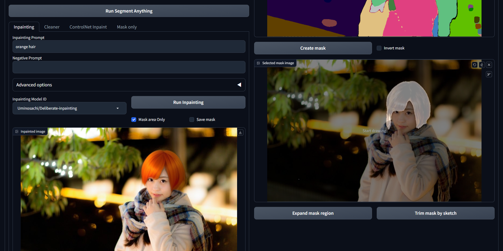

# Inpaint Anything for Stable Diffusion Web UI

Inpaint Anything extension performs stable diffusion inpainting on a browser UI using any mask selected from the output of [Segment Anything](https://github.com/facebookresearch/segment-anything).

Using Segment Anything enables users to specify masks by simply pointing to the desired areas, instead of manually filling them in. This can increase the efficiency and accuracy of the mask creation process, leading to potentially higher-quality inpainting results while saving time and effort.

[Standalone version](https://github.com/Uminosachi/inpaint-anything)

## Installation

To install the software, please follow these steps:

* Open the `Extensions` tab on the AUTOMATIC1111's [Stable Diffusion Web UI](https://github.com/AUTOMATIC1111/stable-diffusion-webui.git).
* Select the `Install from URL` option.
* Enter `https://github.com/Uminosachi/sd-webui-inpaint-anything.git` in the `URL for extension's git repository` field.
* Click on the `Install` button.
* Once installation is complete, restart the Web UI.
* Note: This extension supports v1.3.0 or higher of AUTOMATIC1111's Stable Diffusion Web UI.

## Running the application

* If you intend to use the memory-efficient xformers, please append the `--xformers` argument to your startup command. For example, run `./webui.sh --xformers` or `webui.bat --xformers`
* Note: If you have a privacy protection extension enabled in your web browser, such as DuckDuckGo, you may not be able to retrieve the mask from your sketch.
* Note: In Gradio version 3.23.0 or older, the segmentation image may appear small on the Web UI.

## Downloading the Model

To download the model:

* Go to the `Inpaint Anything` tab of the Web UI.
* Click on the `Download model` button located next to the [Segment Anything Model ID](https://github.com/facebookresearch/segment-anything#model-checkpoints) that include [Segment Anything in High Quality Model ID](https://github.com/SysCV/sam-hq).
  * The SAM is available in three sizes. The sizes are: Base < Large < Huge. Please note that larger sizes consume more VRAM.
  * The HQ-SAM requires more VRAM than Facebook's SAM.
* Wait for the download to complete.
* The downloaded model file will be stored in the `models` directory of this application's repository.

## Usage

* Drag and drop your image onto the input image area.
  * Outpainting can be achieved by the `Padding options`, configuring the scale and balance, and then clicking on the `Run Padding` button.
* Click on the `Run Segment Anything` button.
* Use sketching to point the area you want to inpaint. You can undo and adjust the pen size.
* Click on the `Create mask` button. The mask will appear in the selected mask image area.

### Mask Adjustment

* `Expand mask region` button: Use this to slightly expand the area of the mask for broader coverage.
* `Trim mask by sketch` button: Clicking this will exclude the sketched area from the mask.

### Inpainting Tab

* Enter your desired Prompt and Negative Prompt, then choose the Inpainting Model ID.
* Click on the `Run Inpainting` button (**Please note that it may take some time to download the model for the first time**).
  * In the Advanced options, you can adjust the Sampler, Sampling Steps, Guidance Scale, and Seed.
  * If you enable the `Mask area Only` option, modifications will be confined to the designated mask area only.
* Inpainting process is performed using [diffusers](https://github.com/huggingface/diffusers).
* Tips: You can directly drag and drop the inpainted image into the input image field on the Web UI.

### Cleaner Tab

* Choose the Cleaner Model ID.
* Click on the `Run Cleaner` button (**Please note that it may take some time to download the model for the first time**).
* Cleaner process is performed using [Lama Cleaner](https://github.com/Sanster/lama-cleaner).

### ControlNet Inpaint Tab

* To execute inpainting, use the Stable Diffusion checkpoint, located in the upper left of the Web UI, with the ControlNet inpaint model.
* Enter your desired Prompt and Negative Prompt.
* Click on the `Run ControlNet Inpaint` button to start the process.
  * In the Advanced options, you can adjust the Sampler, Sampling Steps, Guidance Scale, Denoising Strength, and Seed.
* The Control Weight and Control Mode can be modified in the ControlNet options.
  * The Reference-Only Control can be utilized if the Multi ControlNet setting is configured to 2 or higher.
* Make sure to install the ControlNet extension that supports the `inpaint_only` preprocessor and the ControlNet inpaint model.
* Requires: The [sd-webui-controlnet](https://github.com/Mikubill/sd-webui-controlnet) extension and the [ControlNet-v1-1](https://huggingface.co/lllyasviel/ControlNet-v1-1) inpaint model in the `extensions/sd-webui-controlnet/models` directory.

### Mask only Tab

* Gives ability to just save mask without any other processing, so it's then possible to use the mask in img2img's `Inpaint upload` with any model/extensions/tools you already have in your AUTOMATIC1111.
* `Get mask as alpha of image` button: Save the mask as RGBA image, with the mask put into the alpha channel of the input image.
* `Get mask` button: Save the mask as RGB image.
* After the `Get mask` button press you can use `Send to img2img inpaint` button under the mask image to send both input image and mask to the img2img tab.

## Auto-saving images

* The inpainted image will be automatically saved in the folder that matches the current date within the `outputs/inpaint-anything` directory.
* You can switch to the `outputs/img2img-images` directory via the `Inpaint Anything` section found in the `Settings` tab on the Web UI.

## License

The source code is licensed under the [Apache 2.0 license](LICENSE).

## Reference

* Kirillov, A., Mintun, E., Ravi, N., Mao, H., Rolland, C., Gustafson, L., Xiao, T., Whitehead, S., Berg, A. C., Lo, W-Y., Dollár, P., & Girshick, R. (2023). [Segment Anything](https://arxiv.org/abs/2304.02643). arXiv:2304.02643.
* Ke, L., Ye, M., Danelljan, M., Liu, Y., Tai, Y-W., Tang, C-K., & Yu, F. (2023). [Segment Anything in High Quality](https://arxiv.org/abs/2306.01567). arXiv:2306.01567.