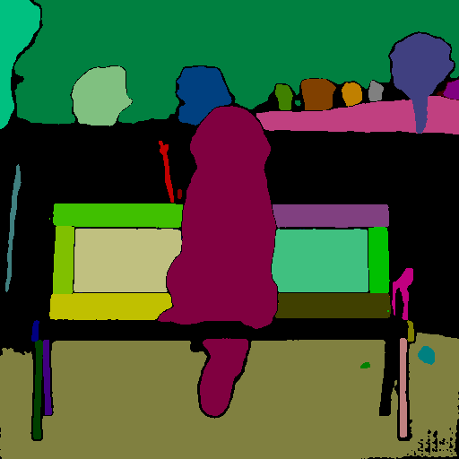
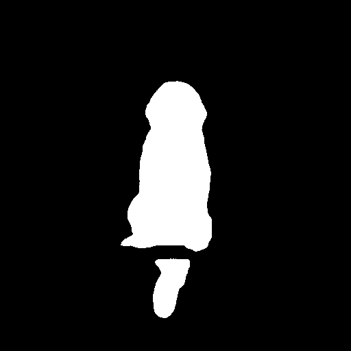

# Usage of Inpaint Anything Library

## Introduction

The `inpalib` from the `extensions.sd-webui-inpaint-anything` package lets you segment images and create masks using sketches from other extensions.

## Code Breakdown

### Imports and Module Initialization

```python
import importlib

import numpy as np
from PIL import Image, ImageDraw

inpalib = importlib.import_module("extensions.sd-webui-inpaint-anything.inpalib")
```

### Fetch Model IDs

```python
available_sam_ids = inpalib.get_available_sam_ids()

use_sam_id = "sam_hq_vit_l.pth"
# assert use_sam_id in available_sam_ids, f"Invalid SAM ID: {use_sam_id}"
```

Note: Only the models downloaded via the Inpaint Anything extension are available.

### Generate Segments Image

```python
input_image = np.array(Image.open("/path/to/image.png"))

sam_masks = inpalib.generate_sam_masks(input_image, use_sam_id, anime_style_chk=False)
sam_masks = inpalib.sort_masks_by_area(sam_masks)

seg_color_image = inpalib.create_seg_color_image(input_image, sam_masks)

Image.fromarray(seg_color_image).save("/path/to/seg_color_image.png")
```

 

### Create Mask from Sketch

```python
sketch_image = Image.fromarray(np.zeros_like(input_image))

draw = ImageDraw.Draw(sketch_image)
draw.point((input_image.shape[1] // 2, input_image.shape[0] // 2), fill=(255, 255, 255))

mask_image = inpalib.create_mask_image(np.array(sketch_image), sam_masks, ignore_black_chk=True)

Image.fromarray(mask_image).save("/path/to/mask_image.png")
```



Note: Ensure you adjust the file paths before executing the code.
